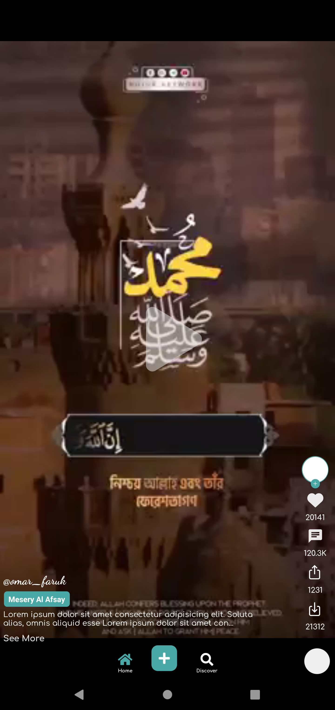
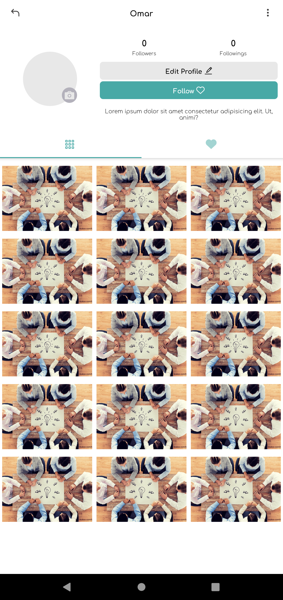
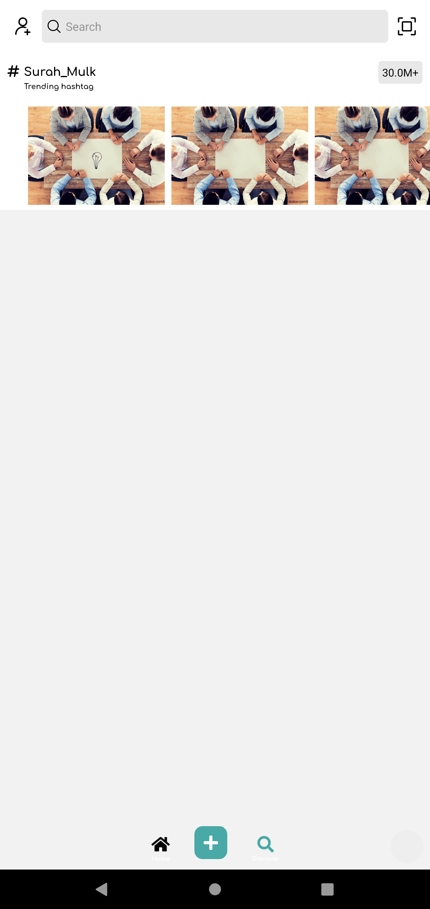
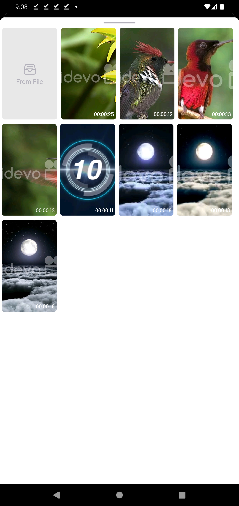
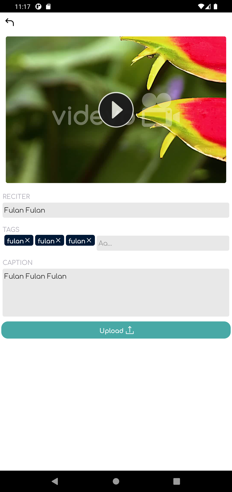

<div id="top"></div>
<!-- PROJECT LOGO -->
<br />

<div align="center">
  <a href="https://github.com/OmarFaruk-0x01/QuranPlay" > 
    
  </a>

<div>

## **Quran Play**

  <p align="center">
   Quran Play is a video-sharing Social Platform App.
    <br />
    <br />
    <a href="https://github.com/OmarFaruk-0x01/QuranPlay/issues">Report Bug</a>
    ·
    <a href="https://github.com/OmarFaruk-0x01/QuranPlay/issues">Request Feature</a>
  </p>
</div>
</div>


<!-- TABLE OF CONTENTS -->
<details open >
  <summary style="cursor: pointer;">Table of Contents</summary>
  <ol>
    <li>
      <a href="#about-the-project">About The Project</a>
      <ul>
        <li><a href="#features-with-snapshots">Features with Snapshots</a></li>
        <li><a href="#built-with">Built With</a></li>
      </ul>
    </li>
        <li><a href="#prerequisites">Prerequisites</a></li>
    <li>
      <a href="#installation">Installation</a>
    </li>
    <li>
      <a href="#setup_run">Setup & Run</a>
    </li>
    <li><a href="#roadmap">Roadmap</a></li>
  </ol>
</details>


<!-- ABOUT THE PROJECT -->
## About The Project
<div align="center">

</div><br>
QuranPlay is a short video-sharing Social Platform made for those who are addicted to TikTok or other time-wasting platforms. The app was made with React Native as a Frontend Technology.

<p align="right">(<a href="#top">back to top</a>)</p>

## Features with Snapshots
1. **Short Video Sharing** 
   <details style="cursor: pointer;" ><summary>snapshot</summary>
   
   </details>
2. **User Profile Like Other Social Platforms**
   <details style="cursor: pointer;" ><summary>snapshot</summary>
   
   </details>
3. **Search Screen**
   <details style="cursor: pointer;"><summary>snapshot</summary>
   
   </details>
4. **Video Upload from storage modal**
   <details ><summary>snapshot</summary>
    
   </details>
5. **Preview Video Upload Screen**
   <details ><summary>snapshot</summary>
    
   </details>
## Built With 
* [React Native](https://reactnative.dev/)
* [React Redux](https://reactnative.dev/)

<p align="right">(<a href="#top">back to top</a>)</p>


## Prerequisites
There are some prerequisites to run this app and server

* **NPM**
  
  Follow the instruction to install [node-js & npm](https://nodejs.org/de/download/package-manager/)
* **React Native**

  React native has great [documentation](https://reactnative.dev/docs/environment-setup) for environment setup 


## Installation
1. Clone the repo
     ```sh
   git clone https://github.com/OmarFaruk-0x01/QuranPlay
   ```
2. Install NPM packages
   ```sh
   npm install
   ```


<p align="right">(<a href="#top">back to top</a>)</p>


<!-- Setup Projects -->
<div id="setup_run"></div>

## Setup & Run
Now you have to run some commands to start the app.
1. To run the application
   ```sh
   npx react-native run-android # 'run-ios' if you are in macOS
   ```
2. To start the developement server
   ```sh
   npx react-native start
   ```
3. To make a Release Build follow [the article][release_build_article].

<p align="right">(<a href="#top">back to top</a>)</p>

## Roadmap
* [ ] User Authentication
* [ ] Signin & Signup Screen
* [ ] Video Upload Ability
* [ ] Video Search Ability 


[release_build_article]: https://instamobile.io/android-development/generate-react-native-release-build-android/
[ngrok_url]: https://ngrok.com/